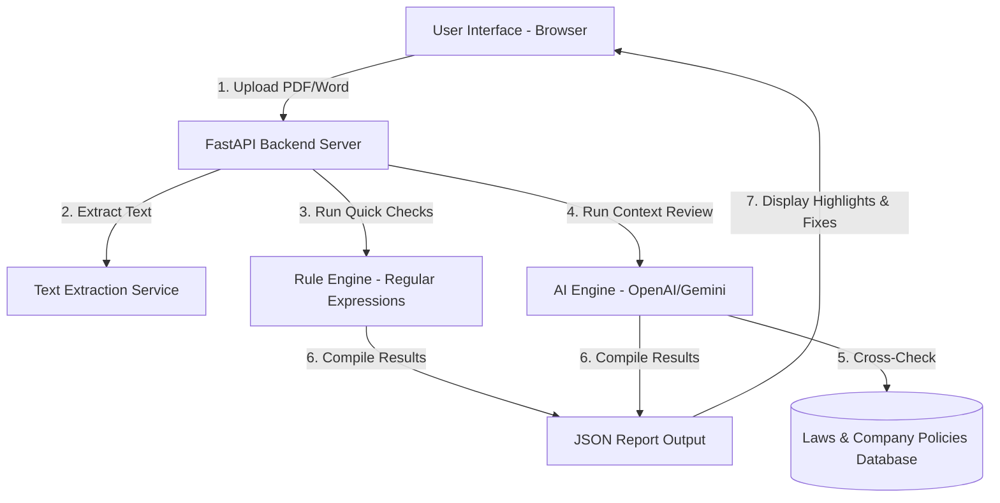

# 🔍 ContractSense — Pitch Deck

This document serves as the official pitch deck for **ContractSense**, submitted for NexHack 2026. 

> 🚀 **[Live Demo (Vercel Website)](https://nex-hack-2026.vercel.app/)**  
> 📺 **[Launch Interactive Presentation Slides](./presentation_slides.html)**  

---

## 1. The Problem Chosen
For small and medium businesses (SMEs) in Malaysia, checking contracts (like hiring offers, room rentals, or sales agreements) before signing is a major headache:

1. **High Legal Fees**: Hiring a lawyer to read a simple contract costs between RM500 to RM2,500. Most SMEs cannot afford this and end up signing unchecked contracts.
2. **Too Many Law Changes**: Laws like the *Employment Act 1955* (updated in 2022 with new rules on leaves and work hours) and the *PDPA 2010* (privacy law) are hard for normal business owners to track and understand.
3. **Slow Turnaround**: Waiting for external lawyers to check a contract takes 3 to 7 days, which slows down business deals and hiring.

---

## 2. Target Users
ContractSense is built for three main groups:

* **HR Managers**: Need to check job offers and employment contracts quickly to make sure leaves, overtime, and work hours follow the latest Malaysian laws.
* **SME Business Owners**: Need to check tenancy agreements, NDAs, and supplier contracts to avoid hidden fees or unfair terms.
* **Corporate Teams**: Need a fast way to run a first-pass check on standard agreements before sending them to the main legal department.

---

## 3. Technical Architecture Diagram
Below is the system data flow showing how a contract is parsed, checked, and analyzed:

---

## 4. Technical & Business Overview

### Technical Highlights
* **Hybrid Engine**: Uses quick regex matching for obvious traps (like auto-renewals) and advanced AI (Gemini/OpenAI) for complex compliance logic.
* **Data Privacy**: Everything is processed in memory. We do not store contract files in public folders, and we do not use your contracts to train public AI models.

### Business Value
* **Massive Cost Savings**: Instantly saves SMEs thousands of Ringgit in legal review fees.
* **Speed**: Reduces compliance check times from days to under 30 seconds.
* **Scalable SaaS**: Built on a tiered subscription model (Free Plan, Professional Plan at RM149/month, and Enterprise Plan at RM499/month).
